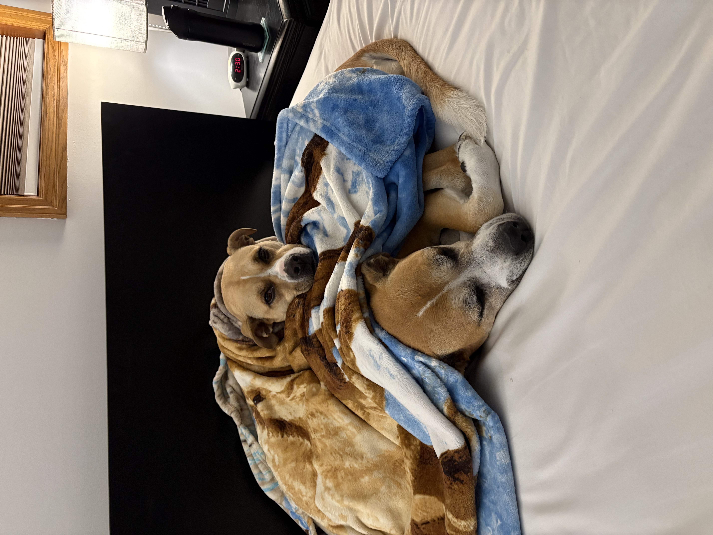

# Canonical Family Photo Library – Manifest Repository


> For information regarding the maintenance of library and generation of manifests click [here](Other/MAINTENANCE.md).

## What this repository is (plain‑English explanation)

This repository **does NOT contain photos or videos**.

Instead, it contains **records (manifests)** that describe:

* What photo/video archives exist
* Where those archives are stored
* Exactly what files are inside each archive
* Cryptographic fingerprints that let us verify nothing was lost or corrupted

Think of this as **an inventory and receipt system**, not a storage system.

A useful analogy:

* **Photos/videos** → boxes stored in a garage or storage unit (Google Drive, external drives)
* **This Git repository** → a written catalog describing every box and what’s inside

The catalog is small, readable, and versioned. The boxes stay large and external.

---

## Why this exists

Family photo libraries tend to fail over time because:

* Files get moved without tracking
* Backups silently fail
* Copies drift out of sync
* Corruption isn’t noticed until years later

This system solves those problems by:

* Separating *storage* from *tracking*
* Making every archive verifiable
* Keeping a clear historical record of changes

---

## What this system DOES

* ✅ Tracks every photo/video archive (ZIP file)
* ✅ Records the exact size and SHA‑256 hash of each archive
* ✅ Records the exact size and SHA‑256 hash of **every file inside** each archive
* ✅ Makes it possible to verify integrity years later
* ✅ Keeps a clean, human‑readable history using Git

## What this system DOES NOT do

* ❌ It does **not** store photos or videos
* ❌ It does **not** replace backups
* ❌ It does **not** automatically sync files
* ❌ It does **not** protect against deleting blobs without backups

This repository only describes reality — it does not enforce it.

---

## Where the actual photos and videos live

All photos and videos live in **ZIP archives stored outside this repository**, typically:

* Google Drive
* External hard drives
* NAS or cloud backups

Example storage layout:

```
Blobs/
├── 2005.zip
├── 2010.zip
└── No Masters (Missing EXIF)/
    └── 2014.zip
```

The **ZIP files are the source of truth for the media**.
This Git repository only tracks their identity and contents.

---

## How to store blobs safely

### Primary rules

1. **Never modify a ZIP in place**

   * If something changes, create a new ZIP and regenerate manifests

2. **Always keep at least two copies of each ZIP**

   * Example:

     * Google Drive
     * External hard drive stored separately

3. **Google Drive is acceptable, but not sufficient alone**

   * Cloud providers are not archives
   * Files can be deleted, corrupted, or accounts lost

### Do we keep old versions of ZIPs?

Recommended:

* **Yes, for important changes**
* Keep previous ZIPs if:

  * Files were added
  * Files were removed
  * Organization changed

Optional but helpful:

* Append versioning to filenames (e.g., `2014_v2.zip`)
* Store older ZIPs in a `Historical/` or `Archive/` folder

If space is limited:

* At minimum, keep **one verified good copy** plus one backup

---

## How changes should be made

If photos or videos change:

1. Create or update the ZIP archive
2. Run the manifest generation scripts
3. Commit the updated manifest files to Git

This keeps the catalog accurate.

Do **not** manually edit JSON files.

---

## Verification

At any time, we can:

* Re‑hash a ZIP
* Compare it against its blob manifest
* Confirm nothing has changed or degraded

This is the long‑term value of the system.

---

## Summary

* Photos and videos live in ZIP files
* ZIP files live in cloud + backups
* This repository keeps a trustworthy inventory
* Git tracks *what changed and when*
* Hashes let us detect corruption or loss

This system exists so future family members can trust the archive — even decades from now.

